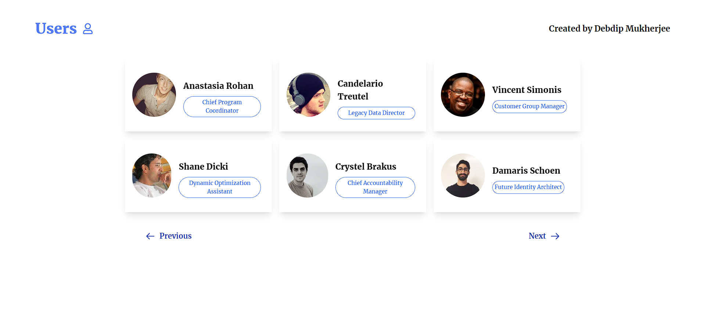

# ATG Data Handler

Welcome to **ATG Data Handler**, a streamlined and efficient data management tool built with the powerful MERN stack (MongoDB, Express.js, React.js, and Node.js). ATG Data Handler is designed to offer a seamless experience for viewing and managing user data.

## Key Features:

- **User Data Display:** Fetch and display a comprehensive list of users with pagination for easy navigation. Access user information quickly and efficiently.

- **Detailed User View:** Click on any user to open a side modal displaying their full details. Gain deeper insights into user profiles with just a single click.

- **Smooth Animations:** Enjoy a polished user experience with loading and error handling animations powered by lottie-react. Experience a visually engaging interface even during data fetches and error scenarios.

- **Responsive Design:** Whether on a desktop or a mobile device, ATG Data Handler ensures a consistent and user-friendly experience across all devices.

Join ATG Data Handler today and take control of your user data with ease and efficiency. Whether you are here to manage, view, or analyze user information, ATG Data Handler is your go-to solution for all things data management.
## Tech Stack

**Client:** React, Tailwind CSS, Axios, Lottie-React, Framer-Motion
## Demo

https://atg-data-handler.vercel.app/

## Installation

Install ATG Data Handler with npm

```bash
  https://github.com/DebdipWritesCode/ATGDataHandler.git
```

Frontend

```bash
  npm install
  npm run dev
```
## Screenshots




